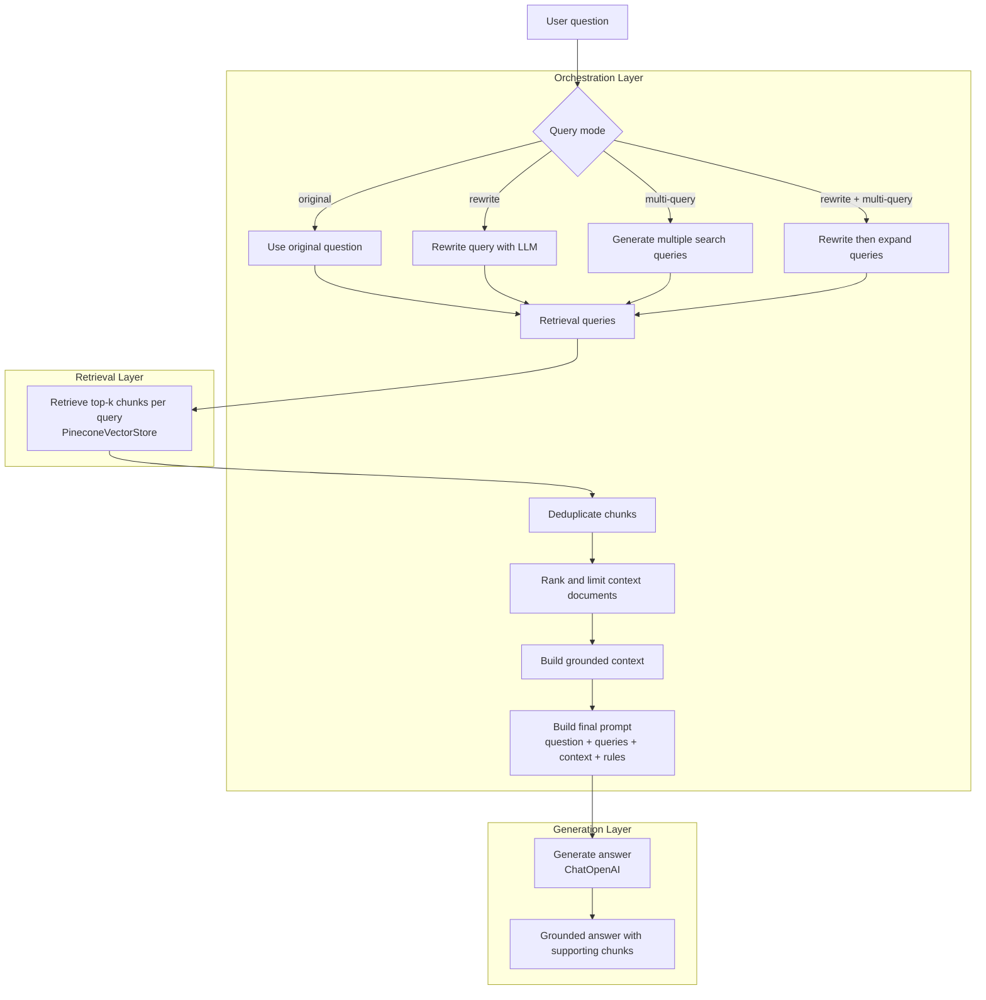

# RAG Orchestration Pipeline

This folder demonstrates the orchestration layer of a Retrieval-Augmented Generation system.

The orchestration layer coordinates query transformation, retrieval, context preparation, and grounded answer generation.

It assumes the indexing pipeline has already populated Pinecone and the generation pipeline has already demonstrated basic retrieval-plus-generation.

## What

The orchestration pipeline is the control layer around RAG.

It answers a user question by coordinating several steps:

1. Receive the original user question.
2. Optionally rewrite the question into a cleaner retrieval query.
3. Optionally generate multiple retrieval queries.
4. Retrieve relevant chunks from Pinecone.
5. Deduplicate retrieved chunks.
6. Build a grounded context.
7. Ask the chat model to answer using only that context.

Main file:

```text
rag_orchestration_pipeline.py
```

This is different from the generation pipeline because it does more than retrieve once and answer once.

It decides how the query should be prepared before retrieval and how multiple retrieval results should be merged before generation.

## Why

A basic RAG pipeline usually looks like this:

```text
question → retrieve → generate
```

That is useful, but real questions are often ambiguous, incomplete, or phrased differently from the indexed documents.

The orchestration layer improves the query-time flow by adding control before and after retrieval.

For example:

```text
original question
→ rewritten query
→ multiple search queries
→ retrieval from Pinecone
→ deduplication
→ context assembly
→ grounded answer
```

This is useful because retrieval quality often depends on the shape of the query.

A user might ask:

```text
Who won the tournament?
```

But the indexed document may contain language like:

```text
Australia won the 2023 Cricket World Cup final.
```

A query transformation step can make retrieval more precise.

In production-style RAG systems, orchestration is where many important decisions live:

- Should the query be rewritten?
- Should we use multi-query retrieval?
- How many chunks should we retrieve?
- How do we deduplicate overlapping results?
- What context should be sent to the LLM?
- What should happen when retrieval finds nothing?
- How do we prevent the LLM from inventing unsupported facts?

## Architecture



## Relationship with the other pipelines

This repository now has three clean RAG stages:

```text
indexing_pipeline
→ prepares the knowledge base

generation_pipeline
→ retrieves from the knowledge base and generates an answer

orchestration_pipeline
→ controls query transformation, retrieval strategy, context assembly, and generation
```

The orchestration pipeline depends on the Pinecone index created by the indexing pipeline.

The values below must match between the indexing, generation, and orchestration pipelines:

```python
index_name = "cwc-rag-index"
namespace = "wikipedia-2023-cricket-world-cup"
embedding_model = "text-embedding-3-small"
```

## config

The main configuration is in the `OrchestrationConfig` dataclass:

```python
@dataclass(frozen=True)
class OrchestrationConfig:
    index_name: str = "cwc-rag-index"
    namespace: str = "wikipedia-2023-cricket-world-cup"

    embedding_model: str = "text-embedding-3-small"
    chat_model: str = "gpt-4o-mini"

    question: str = "Who won the 2023 Cricket World Cup?"
    query_mode: QueryMode = QueryMode.REWRITE_AND_MULTI_QUERY

    top_k_per_query: int = 4
    max_context_docs: int = 6
    max_context_chars_per_doc: int = 1500
```

You can change:

- `question` to ask something else.
- `query_mode` to compare retrieval strategies.
- `top_k_per_query` to retrieve more or fewer chunks per query.
- `max_context_docs` to control how much context is sent to the LLM.
- `chat_model` to use a different OpenAI chat model.
- `namespace` to query a different document collection.

## Cleanup from earlier versions

The existing folder contained two empty placeholder files:

```text
rag_document_index_pipeline.py
rag_query_transformations.py
```

Replace them with the final orchestrator:

```text
rag_orchestration_pipeline.py
```

The cleaned folder should look like this:

```text
orchestration_pipeline/
├── README.md
├── requirements.txt
└── rag_orchestration_pipeline.py
```

## Important folder-name cleanup

The GitHub URL contains `%20`, which means the folder currently has a leading space in its name:

```text
" orchestration_pipeline"
```

Rename it to remove the leading space:

```bash
git mv " orchestration_pipeline" orchestration_pipeline
```

This makes the repository cleaner and avoids confusing paths.

## Notes

This folder focuses on orchestration.

It does not yet include:

- streaming,
- tracing,
- LangGraph state machines,
- reranking,
- hybrid search,
- fallback to web search,
- tool calling,
- chat memory,
- evaluation,
- or deployment automation.

Those would be natural next steps for a more advanced RAGOps lab.
