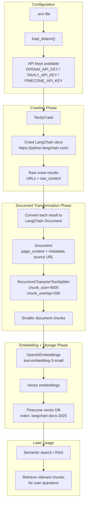

# Tavily LangChain RAG Ingestion Pipeline

This project builds a documentation ingestion pipeline for Retrieval-Augmented Generation, or RAG.

It crawls documentation pages using Tavily, converts the extracted content into LangChain `Document` objects, splits large documents into smaller chunks, embeds those chunks with OpenAI embeddings, and stores the resulting vectors in Pinecone for later semantic search and RAG usage.

## What This Pipeline Does

```text
Website
  ↓
Crawl pages
  ↓
Extract text
  ↓
Create LangChain Document objects
  ↓
Split documents into chunks
  ↓
Embed chunks into vectors
  ↓
Store vectors in Pinecone
  ↓
Use the vector database later for semantic search / RAG
```

## Core Technologies

| Tool | Purpose |
|---|---|
| Tavily | Crawls and extracts documentation pages |
| LangChain | Standardizes documents and orchestrates the ingestion flow |
| RecursiveCharacterTextSplitter | Splits large documents into smaller overlapping chunks |
| OpenAIEmbeddings | Converts text chunks into vector embeddings |
| Pinecone | Stores vectors in a cloud vector database |
| asyncio | Adds chunks to the vector store in concurrent batches |

## Architecture



## Crawling Challenges

Web crawling looks simple at first, but in real systems it can become surprisingly fragile.

Common issues include:

- Rate limiting
- Bot protection
- Dynamically rendered pages
- Environment-specific failures
- Missing pages
- Different behavior across machines

The main observation is:

> Manual crawling often becomes a maintenance burden.

That is why this project delegates crawling to Tavily instead of trying to manually maintain custom crawling logic.

## Offloading Complexity

The guiding principle of this project is:

> Delegate specialized infrastructure to specialized tools.

In other words:

> If crawling is not your core business logic, let a dedicated service handle it.

The purpose of this code is not to become a perfect web crawler.  
The purpose is to create a clean ingestion pipeline for RAG.

Tavily handles the crawling and extraction complexity, while LangChain handles the document transformation, chunking, embedding, and vector storage flow.

## Instructions Parameter

The `instructions` parameter is natural-language guidance given to the crawler.

Its purpose is to influence:

- Which pages should be crawled
- Which pages should be ignored
- Which content is relevant to the ingestion goal

This is especially useful when the target website is large and not every page is relevant to the RAG knowledge base.

## URL Filtering

URL filtering means using instructions to reduce irrelevant pages.

For example, instead of crawling every page from a documentation website, the crawler can be guided to focus on a specific topic, such as:

```text
Only crawl documentation pages related to AI agents, tools, retrievers, and RAG.
Ignore marketing pages, blog posts, changelogs, and unrelated integrations.
```

The result is:

- Fewer irrelevant pages
- Cleaner document chunks
- Better embeddings
- Better downstream retrieval

## Semantic Crawl Filtering

Semantic crawl filtering means filtering based on meaning, not only URL patterns.

Traditional filtering might look for URL patterns such as:

```text
/docs/agents/
```

Semantic filtering goes further. It can decide relevance based on what the page is actually about.

This helps improve crawl precision.

## Crawl Precision

Crawl precision means the relevance of the pages returned by the crawler.

Better crawl precision leads to:

- More relevant pages
- Less noise
- Better document chunks
- Better vector search
- Better RAG answers

In a RAG system, low-quality crawling creates low-quality retrieval.

So the quality of the crawling phase directly affects the quality of the final AI answer.

## Instructions Best Practice

Crawler instructions should help the crawler decide:

- Which URLs to crawl
- Which URLs to skip
- Which topics are relevant
- Which topics are irrelevant

Crawler instructions are not intended for:

- Asking questions
- Running retrieval queries
- Querying the final vector database

They are intended for:

- Content-selection criteria
- Crawl guidance
- Reducing noise before embedding

Good instructions improve the quality of the data before it reaches the vector database.

## Example Ingestion Flow

The script follows this high-level process:

```text
crawl
convert
split
index
summarize
```


## Important Notes

This script prepares the knowledge base for RAG.

It does not yet implement the final question-answering chatbot.

This script is the ingestion side:

```text
documents → chunks → embeddings → vector database
```

A later RAG application would use the Pinecone vector database like this:

```text
user question
  ↓
embed question
  ↓
search Pinecone
  ↓
retrieve relevant chunks
  ↓
send chunks + question to LLM
  ↓
generate grounded answer
```

## Summary

This project demonstrates how to build a clean RAG ingestion pipeline using Tavily, LangChain, OpenAI embeddings, and Pinecone.

The main idea is simple:

> Let Tavily handle crawling, let LangChain structure the documents, let OpenAI create embeddings, and let Pinecone store the searchable vector index.
